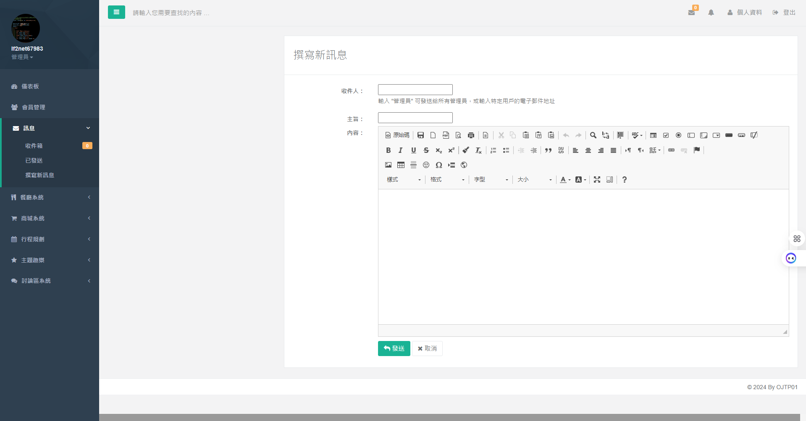
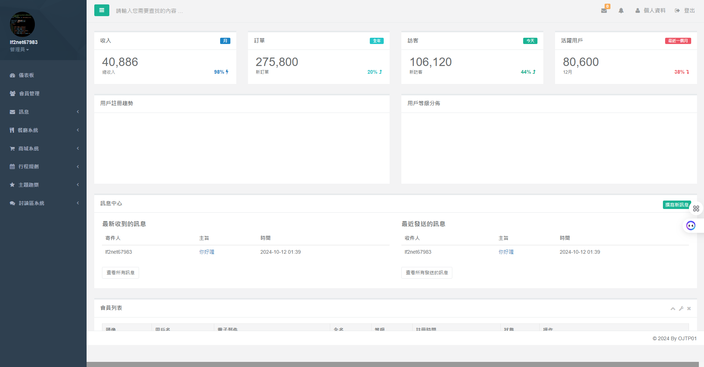
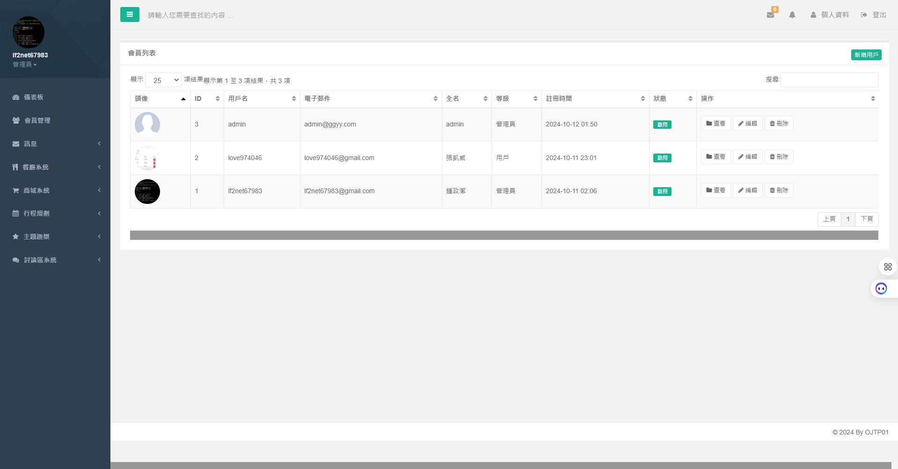

# TravelAdmin 旅遊管理系統

TravelAdmin 是一個綜合性的旅遊管理系統，為用戶提供全方位的旅遊服務和管理功能。

## 功能特性

- 論壇系統：用戶交流旅遊經驗和資訊
- 購物系統：旅遊相關商品購買
- 主題娛樂：主題公園和娛樂設施資訊
- 行程規劃：個性化旅遊行程設計
- 管理員後台：全面管理系統各個模組

## 安裝

要安裝 TravelAdmin，請按照以下步驟操作：

1. 克隆此儲存庫：
   ```bash
   git clone https://github.com/lf2net679/TravelAdmin.git
   ```

2. 進入專案目錄：
   ```bash
   cd TravelAdmin
   ```

3. 創建並啟動虛擬環境：
   ```bash
   python -m venv venv
   source venv/bin/activate  # 在 Windows 上使用 venv\Scripts\activate
   ```

4. 安裝依賴項：
   ```bash
   pip install -r requirements.txt
   ```

5. 運行資料庫遷移：
   ```bash
   python manage.py migrate
   ```

6. 啟動開發伺服器：
   ```bash
   python manage.py runserver
   ```

7. 讀取MySQL .sql檔：

   a. 單個檔案：
   ```bash
   mysql -u 用戶名 -p 數據庫名 < 你的檔案.sql
   ```
   
   b. 匯入整個資料夾中的所有SQL檔案：
   ```bash
   for file in /路徑/到/你的/SQL檔案夾/*.sql; do mysql -u 用戶名 -p 數據庫名 < "$file"; done
   ```
   
   注意：請將 `/路徑/到/你的/SQL檔案夾/` 替換為實際的資料夾路徑。
   
   或者,如果你使用的是MySQL Workbench:
   
   a. 打開MySQL Workbench並連接到你的數據庫
   b. 選擇 "File" > "Open SQL Script"
   c. 選擇你的 .sql 檔案或整個資料夾
   d. 點擊 "Execute" 按鈕(閃電圖標)來運行腳本
   
   對於多個檔案，你可能需要重複步驟 b-d

8. 在settings.py中更新數據庫配置：
   ```python
   DATABASES = {
       'default': {
           'ENGINE': 'django.db.backends.mysql',
           'NAME': '你的數據庫名',
           'USER': '你的MySQL用戶名',
           'PASSWORD': '你的MySQL密碼',
           'HOST': 'localhost',
           'PORT': '3306',
       }
   }
   ```

9. 安裝MySQL客戶端：
   ```bash
   pip install mysqlclient
   ```

10. 再次運行數據庫遷移：
    ```bash
    python manage.py migrate
    ```

## 使用方法

1. 訪問 `http://localhost:8000` 進入系統主頁。
2. 註冊新用戶或使用現有帳戶登入。
3. 瀏覽各個功能模組，如論壇、餐廳推薦、購物等。
4. 管理員可以通過後台管理系統管理所有模組。

## 專案結構

- `forum_system/`: 論壇系統模組
- `shopping_system/`: 購物系統模組
- `theme_entertainment/`: 主題趣樂模組
- `trip_planner/`: 行程規劃模組
- `myapp/`: 主應用模組
- `myproject/`: 專案配置文件
- `static/`: 靜態文件目錄
- `media/`: 媒體文件目錄

## 貢獻

我們歡迎所有形式的貢獻！如果您想為 TravelAdmin 做出貢獻，請遵循以下步驟：

1. Fork 這個專案
2. 創建您的特性分支 (`git checkout -b feature/AmazingFeature`)
3. 提交您的更改 (`git commit -m '添加一些很棒的功能'`)
4. 將您的更改推送到分支 (`git push origin feature/AmazingFeature`)
5. 開啟一個 Pull Request

## 授權條款

本專案採用 MIT 授權條款。查看 `LICENSE` 文件以獲取更多資訊。

## 聯絡方式

如果您有任何問題或建議，請通過以下方式聯絡我們：

- GitHub Issues: https://github.com/lf2net679/TravelAdmin/issues

感謝您使用 TravelAdmin 旅遊管理系統！

##功能demo




